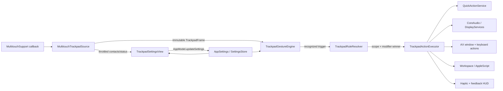

# Trackpad gesture automation — technical design

## Decision summary

Implement the module in the existing `MenuCue` target with an original SwiftUI settings surface and a dynamically loaded raw-trackpad provider. The provider uses macOS's private `MultitouchSupport.framework` only after explicit module enablement; passive observation never filters normal pointer or scroll events. Direct CoreAudio volume control and dynamically loaded DisplayServices brightness control keep the requested built-in gestures independent of Accessibility authorization.

The private provider is a deliberate direct-distribution trade-off. All symbols are resolved at runtime, every unsafe boundary validates symbol/layout assumptions, and unsupported systems show a persistent unavailable state. No private framework is linked at build time. Mac App Store compatibility remains out of scope.

## Architecture



### New files and responsibilities

- `TrackpadGestureModels.swift`: stable Codable settings, rules, triggers, actions, scopes, modifiers, points, defaults, normalization, import/export envelope.
- `TrackpadGestureEngine.swift`: pure frame/session recognition and rule resolution; no AppKit side effects.
- `MultitouchTrackpadSource.swift`: dynamic private API loading, 96-byte C layout, device enumeration/reconciliation, callback registration, frame copying, lifecycle status.
- `TrackpadActionExecutor.swift`: permission-aware action dispatch, CoreAudio/brightness control, window actions, key/mouse synthesis, open targets, scripts, existing Quick Actions, feedback HUD.
- `TrackpadGestureService.swift`: long-lived runtime owner connecting settings, source, engine, frontmost-app scope, modifier snapshot, executor, diagnostics, wake/device lifecycle.
- `TrackpadSettingsView.swift`: native settings pane, live device preview, master switch, rule list/editor, import/export/reset, status/remediation.
- Existing integration points: `AppModels.swift`, `SettingsStore.swift`, `AppModel.swift`, `StatusPopoverView.swift`, `QuickActionService.swift`, localization catalogs, `Package.swift` only when a public framework link is required.

## Persisted contract

`AppSettings` gains `trackpadGestureSettings` with a defaulted initializer argument so existing call sites remain source-compatible. `SettingsStore` owns one versioned JSON value, `trackpadGestureSettings.v1`. Decode failure falls back to presets without disturbing neighboring settings. The field is intentionally absent from `PortableSettingField` and iCloud envelopes.

```text
TrackpadGestureSettings
  isEnabled
  hapticFeedbackEnabled
  feedbackHUDEnabled
  suppressesClickAfterMultiFingerTap (default false)
  edgeWidth
  sensitivity
  rules: [TrackpadGestureRule]

TrackpadGestureRule
  id: UUID
  name / note
  isEnabled
  requiredModifiers
  scope
  activatesWindowUnderPointer
  trigger
  action
```

Rules normalize independently: duplicate IDs are regenerated, invalid numeric thresholds are clamped, unsupported enum values reject only their rule during import, and rule order remains authoritative. Specific-app rules are evaluated before all-app rules; within the same specificity, the first matching enabled rule wins. Exclusions always win for their listed bundle IDs.

## Trigger model and BetterAndBetter coverage

The local BetterAndBetter 2.7.7 resources expose 89 touch menu entries. They reduce to the generic families below, avoiding 89 hard-coded recognizers while preserving every visible configuration shape.

| Generic trigger | Visible BetterAndBetter family covered |
|---|---|
| `contact` with 1–5 fingers and `tap`, `doubleTap`, `click`, or `forceClick` | One- through five-finger tap/click/double-tap/force-click |
| `contact` plus a 3×3 region | One-finger center, side, corner, and edge tap/click |
| `swipe` with 2–5 fingers and four directions | Two- through five-finger directional swipes |
| `edgeEntrySwipe` | Two-finger top/bottom/left/right slide-in |
| `pinch` with 2–4 fingers | Pinch in/out |
| `tipTap` with contact index and near/normal/far spacing | Two-finger left/right near/far tap and three/four-finger selected-finger tap |
| `fingerSwipe` with contact index and direction | Left/right selected finger swipes while the remaining fingers stay anchored |
| `drawing` with recorded normalized path | Modifier + one-finger drawing and bottom-thumb + another-finger drawing |
| `edgeContinuous` | Requested one-finger edge volume/brightness controller |

`click` and `forceClick` are derived from contact density/size thresholds and session shape because raw MultitouchSupport contacts do not expose a stable public click enum. Thresholds are adjustable; unsupported hardware reports these triggers as unavailable rather than silently aliasing them to tap.

### Recognition state

The raw callback copies each frame immediately into:

```text
TrackpadFrame(deviceID, timestamp, frameNumber, contacts[])
TrackpadContact(id, state, x, y, velocity, size, density, majorAxis, minorAxis)
```

The callback does no matching, allocations beyond the bounded frame copy, UI work, or actions. A dedicated serial queue owns one session per device.

- Contact identity is the private frame identifier; left/right roles are assigned by initial normalized x position, not anatomy.
- Y increases from the physical bottom toward the top.
- Missing/break/out contacts end their paths; cancellation, wake, removal, or timestamp reversal resets the whole device session.
- A discrete recognition emits one token and disarms until the session ends.
- Continuous edge rules emit quantized steps from accumulated vertical distance with hysteresis, cooldown, and a maximum action rate.
- Drawing paths use a deterministic $1-style normalized unistroke matcher: resample, rotate, scale, translate, compare, and require the configured minimum score.

### Requested hold-tap contract

A two-contact session sorts A left of B. Both must stabilize before arming. If A leaves while B remains inside hold tolerance, A may return near its original side and complete one short tap; commit Volume Up on A's final lift. The inverse commits Volume Down. Movement, extra contacts, simultaneous release, timeout, or cancellation aborts. The default presets use conservative timing and are editable.

## Raw device provider

`MultitouchTrackpadSource` opens one of the known system framework paths with `dlopen`, then requires:

- `MTDeviceCreateList`
- `MTRegisterContactFrameCallback`
- `MTUnregisterContactFrameCallback`
- `MTDeviceStart`
- `MTDeviceStop`
- `MTDeviceGetDeviceID`
- `MTDeviceIsBuiltIn`

The private contact layout is asserted to be 96 bytes on 64-bit. The source keeps the returned CFArray alive while callbacks are registered, keys callbacks by stable device ID, and unregisters/stops before releasing the list. It reconciles after enablement, wake, app activation, and bounded device checks; unchanged device sets are not restarted.

Runtime states are `disabled`, `starting`, `running(deviceCount)`, `unsupported(reason)`, and `failed(reason)`. Unsupported symbols, no devices, malformed dimensions, or a callback failure never enable partial gesture execution.

## Action model and permission boundary

| Action | Implementation | Permission |
|---|---|---|
| Volume up/down/set/mute | CoreAudio HAL default output device; verify settable property and read back | None |
| Brightness up/down/set | Runtime-loaded DisplayServices for the display under the pointer, with read-back | None on supported displays |
| Existing built-in action / Apple Shortcut | Reuse `QuickActionReference` and `QuickActionService.perform` | Existing action-specific behavior |
| Keyboard shortcut | Quartz key events | Accessibility, requested only when this action runs |
| Mouse click / scroll | Quartz events | Accessibility, requested only when this action runs |
| Suppress the native left click after a recognized multi-finger tap | Separate active event tap, armed only by a matching recognition; all other events pass through | Accessibility; explicit opt-in and remediation |
| Open app, URL, file, folder | `NSWorkspace` | None |
| AppleScript | `NSAppleScript` | Automation only when the script contacts another app |
| Window left/right/top/bottom/corner/maximize/center/restore | Focused AX window position/size with visible-screen geometry | Accessibility |
| Activate window below pointer | Topmost on-screen window owner activation before the main action | None where window metadata is available; fail closed otherwise |

The local BetterAndBetter action picker exposes Shortcut Keys, Preset, AppleScript, and Simulate Trackpad Gesture. Simulated trackpad gestures are explicitly described there as a normal-mouse-only action, so they are not offered from MenuCue's trackpad rules. Presets map to the concrete actions above rather than a second action engine.

Each action reports availability and remediation before execution. Accessibility denial opens the Accessibility System Settings pane from an explicit button; it never loops a prompt. Automation errors preserve the system message. Direct volume/brightness requests publish only observed read-back values.

## Settings UX

Add `.trackpad` immediately before `.quickActions`; do not add a fifth popover tab. The pane uses the existing Settings header/group vocabulary.

1. Runtime group: master switch, supported-device count, provider state, privacy explanation, and retry/reconcile action.
2. Live preview: native trackpad outline with bounded 30 Hz contact dots and last recognized gesture; hidden when disabled.
3. Presets and rules: ordered rows with enable, name, trigger summary, action summary, app scope, pointer-focus indicator, disclosure editor, duplicate/delete/reorder.
4. Rule editor: trigger family fields, modifiers, app include/exclude picker, action fields, note, haptic/HUD behavior, and live record surface for drawing.
5. Management: add rule, import JSON, export JSON, reset presets.

All controls expose labels/help, retain keyboard focus, use the existing `MotionProfile`, and avoid modal-only editing. English and Simplified Chinese catalogs remain key-identical.

## Clean Keyboard remediation

Replace the Boolean-only blocker start result with a typed failure: `accessibilityDenied`, `eventTapUnavailable`, or `started`. The Quick Action state advertises the current permission requirement and Accessibility settings URL. If trust is false, the action explains that macOS owns the decision and offers Open System Settings; if trust is true but tap creation fails, it reports the distinct runtime failure. Existing screen cleaning remains unchanged.

## Lifecycle, compatibility, and rollback

- The service is created once by `AppModel`, applies loaded settings after initialization, and stops in deinit/application termination.
- Settings changes go through `AppModel.updateSettings`; `applySettings` reconfigures the service only when its trackpad field changes.
- Sleep/wake and device removal clear recognition sessions before callbacks are rebuilt.
- Disabling the feature is the operational rollback. Removing the new UserDefaults key returns to disabled presets; no migration touches existing keys.
- The release remains macOS 13+ Developer ID distribution. Runtime private API failure degrades only the Trackpad pane and never blocks app startup.
